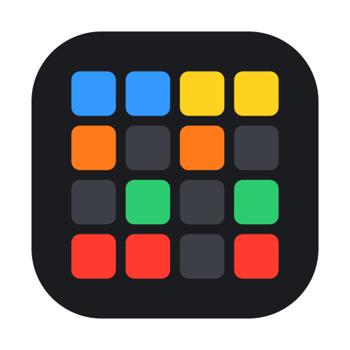

<h1 align="center">Wavethings Kit Creator</h1>

Generate hundreds of MPC drum kits by assigning whole folders of samples to pads. 
Genera cientos de kits de batería para MPC asignando carpetas completas de samples a los pads.

**English · [Español](#español)**

**Wavethings Kit Creator** is a free, open-source tool by **Wavethings** that builds MPC programs in the classic
`.xpm` format (not the newer `.xtd`) from your own sample folders: pick your folders, click the pads, and get as many
kits as you want, each with different random samples.

## Features
- **One or several folders per pad**: mix different sample packs. Each kit picks a folder at random (equal chance for
  each) and then a random sample from it.
- Add many folders at once (⌘-click, or a parent folder to add all its subfolders).
- 8 banks (A–H, 128 pads) with **copy bank → another bank / all banks**.
- **Mute groups (choke)** per folder, e.g. closed + open hi-hat.
- **Presets**: save and recall your folders, pad assignments, choke groups and colors.
- **Filter by key**: detects the root note in file names (e.g. "Bass_C1", "Synth_Dm") and keeps every kit in one key, fixed or random per kit; folders without a detected key are unaffected.
- **Pack / keyword mode**: point at one big sample pack and assign pads a keyword group from a dropdown (e.g. "Kick") instead of a whole folder. A sample belongs to a group by its **subfolder names and its file name** ("Drum - Kick - One Shots/…", "Kick 01.wav"), and a keyword written with a dash, like `-loop`, is an **exclusion**, so one-shot groups never pick loops. Default groups: Kick, Snare, Clap, Closed Hihat, Open Hihat, Percusion, Melodic, FX, Fill, Vocal, Loop. The groups live in an editable text file, `keyword_groups.txt`, in the app's settings folder — edit it with one click via "✎ Edit keyword groups". A folder used this way is always scanned into its subfolders, regardless of the "include subfolders" setting.
- **All kits and samples in one folder** (option): instead of a folder per kit, every `.xpm` and all samples go straight into the output folder — easier to browse on the MPC, whose file browser can filter to show only kits. Identical samples are shared between kits; nothing existing is overwritten. Command line: `--flat` (config: `"flat_output": true`).
- **Colors by keyword group**: give a group its own color (the small dot next to its dropdown) so every pad set to it matches, wherever it's assigned, overriding the folder's color just for that pad.
- **Pad colors** per folder; pads that mix folders show diagonal stripes.
- **Number samples by pad**, for samplers with no `.xpm` support of their own (Maschine, Battery, hardware
  samplers): select a bank's 16 files together and drop them onto the sampler's first pad.
- Built-in empty template (no `.xpm` needed), or use your own as a base.
- English / Español interface: starts in your browser's language, switch at the top right.
- Pure Python standard library. No installs, no internet, no tracking. Your samples never leave your computer.

## Requirements
- Python 3.9 or newer. On macOS, if `python3` is missing, run `xcode-select --install`.
- macOS gets native folder dialogs and the `.app` builder. On Windows and Linux the interface works too, but you type
  folder paths instead of picking them.

## Quick start
Needs Python 3.9+ (already on most Macs and Linux machines; on Windows, install it from
[python.org](https://python.org) and tick "Add to PATH"), nothing else.
1. Click **Code → Download ZIP** on this page and unzip it (or `git clone` it).
2. Open a Terminal in that folder and run:

       python3 kit_creator_gui.py

3. Your browser opens the app. Add folders, select one, click pads to assign it, choose an output folder and press
   **Generate kits**.

### Make a double-clickable macOS app
    python3 build_app.py
Drag the generated `Wavethings Kit Creator.app` to Applications. Closing the browser tab quits the app. Run
`build_app.py` again after updating the scripts. Settings, presets, `keyword_groups.txt` and `group_colors.json` (see
Pack mode above) are kept in `~/Library/Application Support/Wavethings Kit Creator/` (Windows: `%APPDATA%`, Linux:
`~/.config`); back up that folder to keep them.

### Command line (no interface)
    python3 mpc_kit_creator.py -o ~/MPC_Kits -n 20 \
        --pad 1=~/Samples/Kicks --pad 2=~/Samples/Snares --pad 3-4=~/Samples/Hats --mute 3-4=1
or `python3 mpc_kit_creator.py -c config_example.json`. Use `--lang en|es` to force a language, `--match-key [KEY]` to filter by key (omit KEY for a random key per kit), and `-h` for all options.

## Loading kits on the MPC
Each kit is a folder containing the `.xpm` and its samples. Copy the kit folders to your MPC's storage (or your
computer's MPC library) and load the `.xpm` as a drum program.

## Known limits
- Only a pad's first folder decides its color and mute group.
- Colors marked "?" are estimates of the MPC palette. Use *Import colors from an .xpm* to calibrate them with a
  program you colored on your MPC.
- Audio formats: `.wav`, `.aif`, `.aiff`.
- Tested with the classic `.xpm` format (File_Version 2.1). Please report your MPC model and software version if
  something does not load.
- Pack / keyword mode is currently only available from the interface; the command line and config file assign by
  folder only.

## Contributing
Bug reports, ideas and pull requests are welcome. See [CONTRIBUTING.md](CONTRIBUTING.md). Adding a new interface
language only takes translating one block of text.

## License and brand
Code: [MIT License](LICENSE) © 2026 Wavethings. The Wavethings name and icon are not covered by the code license, see
[TRADEMARK.md](TRADEMARK.md). *Not affiliated with or endorsed by Akai Professional or inMusic. "MPC" is a trademark
of its owner.*

---

# Español

**Wavethings Kit Creator** es una herramienta gratuita y de código abierto de **Wavethings** que crea programas de MPC
en el formato clásico `.xpm` (no el nuevo `.xtd`) a partir de tus propias carpetas de samples: eliges las carpetas,
pulsas los pads y obtienes tantos kits como quieras, cada uno con muestras aleatorias distintas.

## Características
- **Una o varias carpetas por pad**: mezcla sample packs. En cada kit se elige una carpeta al azar (misma probabilidad
  para todas) y luego una muestra de ella.
- Añade muchas carpetas a la vez (⌘-clic, o una carpeta madre para añadir todas sus subcarpetas).
- 8 bancos (A–H, 128 pads) con **copia de banco → otro banco / todos**.
- **Grupos de choque (choke)** por carpeta, p. ej. hi-hat cerrado y abierto.
- **Presets**: guarda y recupera tus carpetas, asignaciones de pads, grupos de choque y colores.
- **Filtro por tonalidad**: detecta la nota raíz en los nombres de archivo (p. ej. "Bass_C1", "Synth_Dm") y mantiene cada kit en una sola tonalidad, fija o al azar por kit; las carpetas sin tonalidad detectada no se ven afectadas.
- **Modo Pack / palabra clave**: señala un pack grande y asigna a cada pad un grupo de palabras clave (p. ej. «Kick») desde un desplegable, en vez de una carpeta entera. Una muestra pertenece a un grupo por el **nombre de sus subcarpetas y por el nombre del archivo** («Drum - Kick - One Shots/…», «Kick 01.wav»), y una palabra con guion, como `-loop`, es una **exclusión**, así los grupos de one-shots nunca cogen loops. Grupos por defecto: Kick, Snare, Clap, Closed Hihat, Open Hihat, Percusion, Melodic, FX, Fill, Vocal, Loop. Los grupos se guardan en un archivo de texto editable, `keyword_groups.txt`, en la carpeta de configuración de la app — se edita con un clic desde «✎ Editar grupos de palabras clave». Una carpeta usada así siempre se escanea con sus subcarpetas, sin importar la casilla «Incluir subcarpetas».
- **Todos los kits y samples en una sola carpeta** (opción): en vez de una carpeta por kit, todos los `.xpm` y los samples van directamente a la carpeta de salida — más cómodo en la MPC, cuyo navegador puede filtrar para mostrar solo kits. Los samples idénticos se comparten entre kits y no se sobrescribe nada. Línea de comandos: `--flat` (config: `"flat_output": true`).
- **Colores por grupo de palabras clave**: dale a un grupo su propio color (el puntito junto a su desplegable) para que todos los pads con ese grupo lo lleven, dondequiera que estén, sustituyendo al color de la carpeta solo en esos pads.
- **Colores de pad** por carpeta; los pads con varias carpetas se ven con franjas diagonales.
- **Numerar samples por pad**, para samplers sin soporte propio de `.xpm` (Maschine, Battery, samplers hardware):
  selecciona juntos los 16 archivos de un banco y suéltalos sobre el primer pad del sampler.
- Plantilla vacía integrada (no hace falta ningún `.xpm`), o usa la tuya como base.
- Interfaz English / Español: empieza en el idioma del navegador y se cambia arriba a la derecha.
- Solo biblioteca estándar de Python. Sin instalaciones, sin internet, sin rastreo. Tus samples no salen de tu equipo.

## Requisitos
- Python 3.9 o superior. En macOS, si falta `python3`, ejecuta `xcode-select --install`.
- macOS tiene diálogos nativos de carpetas y el creador de la `.app`. En Windows y Linux la interfaz también funciona,
  pero hay que escribir las rutas de las carpetas en vez de elegirlas.

## Inicio rápido
1. Pulsa **Code → Download ZIP** en esta página y descomprime (o usa `git clone`).
2. Abre una Terminal en esa carpeta y ejecuta:

       python3 kit_creator_gui.py

3. Se abre la app en el navegador. Añade carpetas, selecciona una, pulsa pads para asignarla, elige la carpeta de
   salida y pulsa **Generar kits**.

### App de macOS con doble clic
    python3 build_app.py
Arrastra `Wavethings Kit Creator.app` a Aplicaciones. Al cerrar la pestaña del navegador la app se cierra sola. Vuelve
a ejecutar `build_app.py` tras actualizar los scripts. La configuración, los presets, `keyword_groups.txt` y
`group_colors.json` (ver el modo Pack más arriba) se guardan en `~/Library/Application Support/Wavethings Kit
Creator/` (Windows: `%APPDATA%`, Linux: `~/.config`); haz copia de esa carpeta para conservarlos.

### Línea de comandos (sin interfaz)
    python3 mpc_kit_creator.py -o ~/MPC_Kits -n 20 \
        --pad 1=~/Samples/Kicks --pad 2=~/Samples/Snares --pad 3-4=~/Samples/Hats --mute 3-4=1
o `python3 mpc_kit_creator.py -c config_example.json`. `--lang en|es` fuerza el idioma, `--match-key [TONALIDAD]` filtra por tonalidad (sin valor = tonalidad al azar por kit), y `-h` muestra todas las opciones.

## Cargar los kits en la MPC
Cada kit es una carpeta con el `.xpm` y sus samples. Copia las carpetas de kits al almacenamiento de tu MPC (o a la
biblioteca de MPC de tu ordenador) y carga el `.xpm` como programa de batería.

## Límites conocidos
- Solo la primera carpeta de un pad decide su color y su grupo de choque.
- Los colores marcados con "?" son estimaciones de la paleta de la MPC. Usa *Importar colores de un .xpm* para
  calibrarlos con un programa que hayas coloreado en tu MPC.
- Formatos de audio: `.wav`, `.aif`, `.aiff`.
- Probado con el formato `.xpm` clásico (File_Version 2.1). Si algo no carga, cuéntanos tu modelo de MPC y versión de
  software.
- El modo Pack / palabra clave está disponible por ahora solo desde la interfaz; la línea de comandos y el archivo de
  configuración asignan solo por carpeta.

## Colaborar
Se agradecen informes de errores, ideas y *pull requests*. Consulta [CONTRIBUTING.md](CONTRIBUTING.md). Añadir un
idioma nuevo solo requiere traducir un bloque de texto.

## Licencia y marca
Código: [Licencia MIT](LICENSE) © 2026 Wavethings. El nombre y el icono de Wavethings no están cubiertos por la
licencia del código, consulta [TRADEMARK.md](TRADEMARK.md). *Sin relación con Akai Professional ni inMusic. "MPC" es
una marca de su propietario.*
